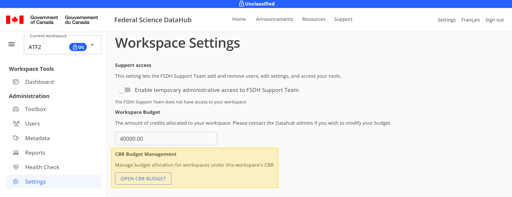
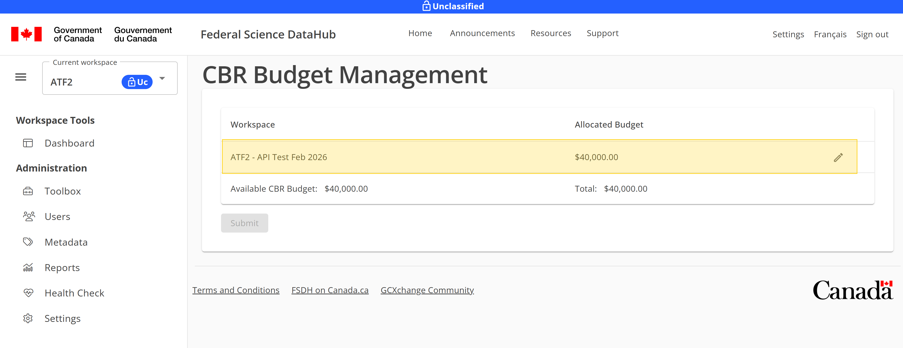
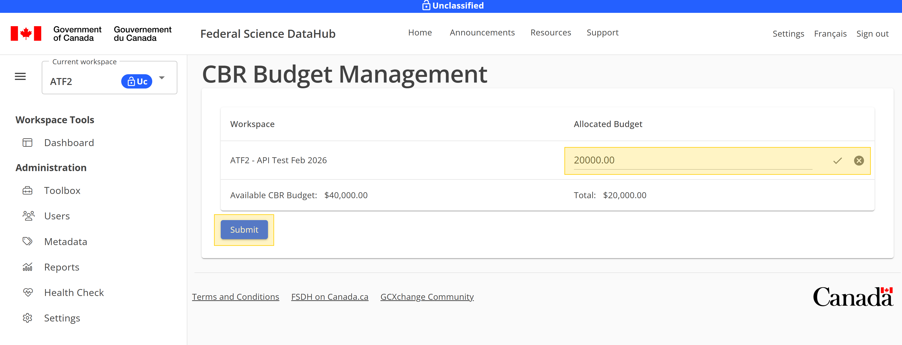
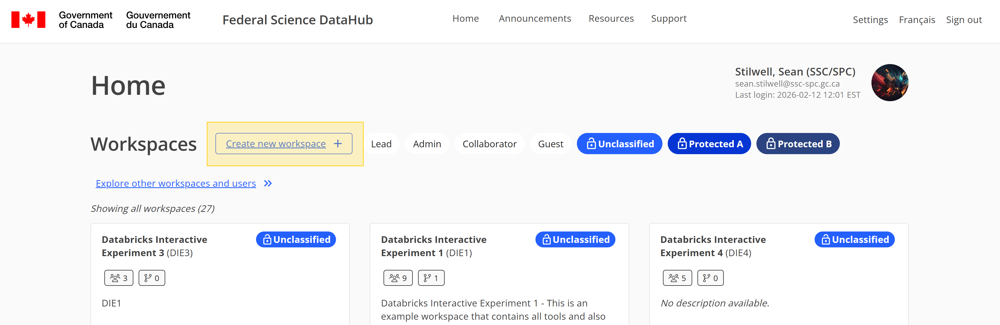
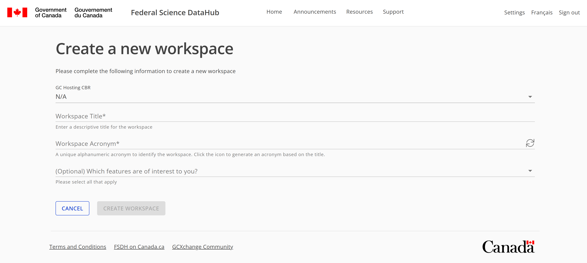

# Manage your CBR & workspace budgets

As part of FSDH onboarding, you have a Cloud Business Requirement (CBR) that provides the budget for your FSDH workspace. By default, the full CBR amount is allocated to your first workspace, but you can manage the allocation of your CBR budget across multiple workspaces if needed. This allows you to optimize your spending and ensure that you have enough budget for each workspace based on your project requirements.

## Modify the budget allocation for your workspaces

To modify the budget allocation, navigate to the CBR Budget page in the FSDH portal. A workspace lead can access it from "Settings" > "Open CBR Budget" in their workspace.

Then, click the Edit button beside the workspace you want to modify the budget for.

Input the new budget amount for the workspace and click Submit to apply the changes.

The new budget allocation will be updated and modify the amount of available budget for your CBR. You can repeat this process for each workspace to manage the budget allocation across all your workspaces as needed.

## Add a new workspace to your CBR

If you are the workspace lead and have remaining budget, you can add a new workspace from the Home page of the FSDH.

Select your CBR and input a workspace name, acronym, and the budget amount you want to allocate to the new workspace. Then click Submit to create the new workspace with the specified budget allocation.

The new workspace will be created and added to your CBR with the allocated budget. You will automatically be redirected to the new workspace where you can start working on your project.