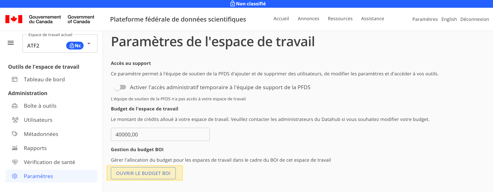
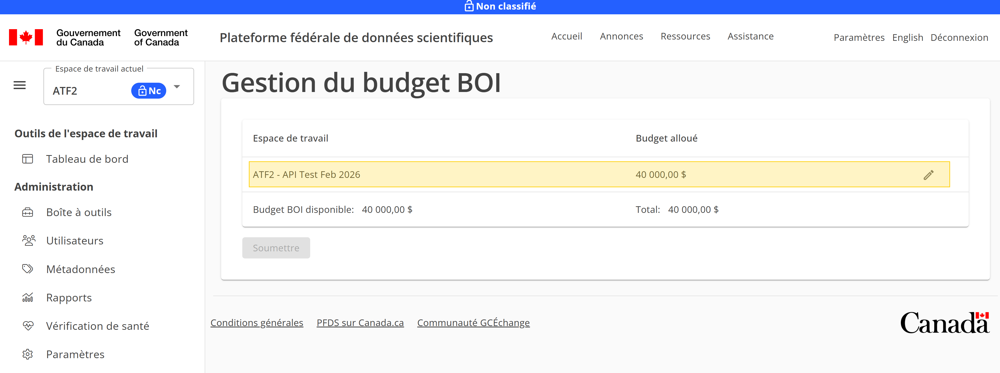
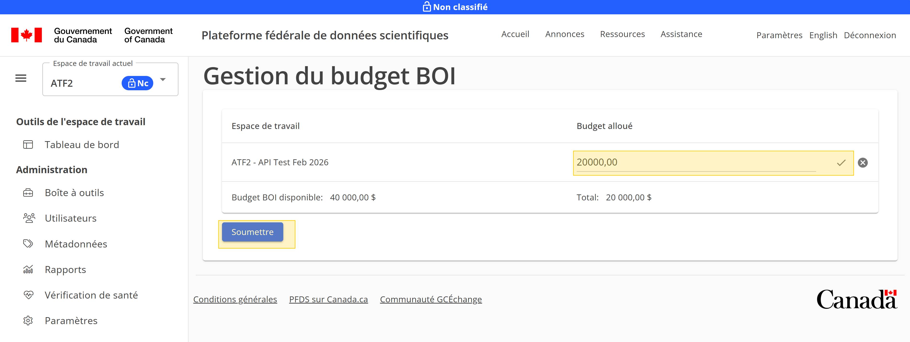
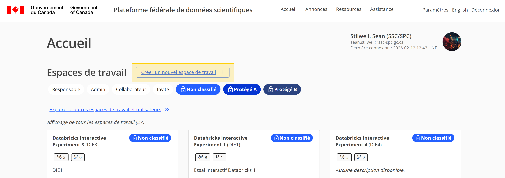
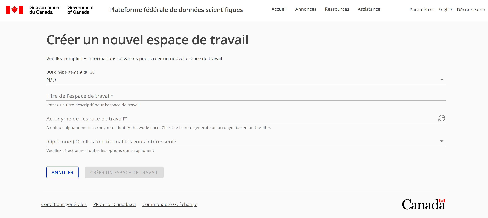

# Gérez vos budgets BOI et espaces de travail

Lorsque vous vous inscrivez sur la PFDS, vous disposez d'un budget BOI (Besoin opérationnel infonuagique) qui vous permet de financer votre espace de travail PFDS. Par défaut, la totalité du budget BOI est allouée à votre premier espace de travail, mais vous pouvez gérer la répartition de votre budget BOI entre plusieurs espaces de travail si nécessaire. Cela vous permet d'optimiser vos dépenses et de vous assurer que vous disposez d'un budget suffisant pour chaque espace de travail en fonction des exigences de votre projet.

## Modifier l'allocation budgétaire de vos espaces de travail

Pour modifier l'allocation budgétaire, accédez à la page Budget BOI dans la PFDS. Un responsable d'espace de travail peut y accéder à partir de « Paramètres » > « Ouvrir le budget BOI » dans son espace de travail.

Cliquez ensuite sur le bouton Modifier à côté de l'espace de travail dont vous souhaitez modifier le budget.

Saisissez le nouveau montant du budget pour l'espace de travail et cliquez sur Soumettre pour appliquer les modifications.

La nouvelle allocation budgétaire sera mise à jour et modifiera le montant du budget disponible pour votre BOI. Vous pouvez répéter ce processus pour chaque espace de travail afin de gérer l'allocation budgétaire de tous vos espaces de travail selon vos besoins.

## Ajouter un nouvel espace de travail à votre BOI

Si vous êtes responsable de l'espace de travail et disposez d'un budget restant, vous pouvez ajouter un nouvel espace de travail à partir de la page d'accueil de la PFDS.

Sélectionnez votre BOI et saisissez le nom de l'espace de travail, son acronyme et le montant du budget que vous souhaitez allouer au nouvel espace de travail. Cliquez ensuite sur Soumettre pour créer le nouvel espace de travail avec l'allocation budgétaire spécifiée.

Le nouvel espace de travail sera créé et ajouté à votre BOI avec le budget alloué. Vous serez automatiquement redirigé vers le nouvel espace de travail où vous pourrez commencer à travailler sur votre projet.