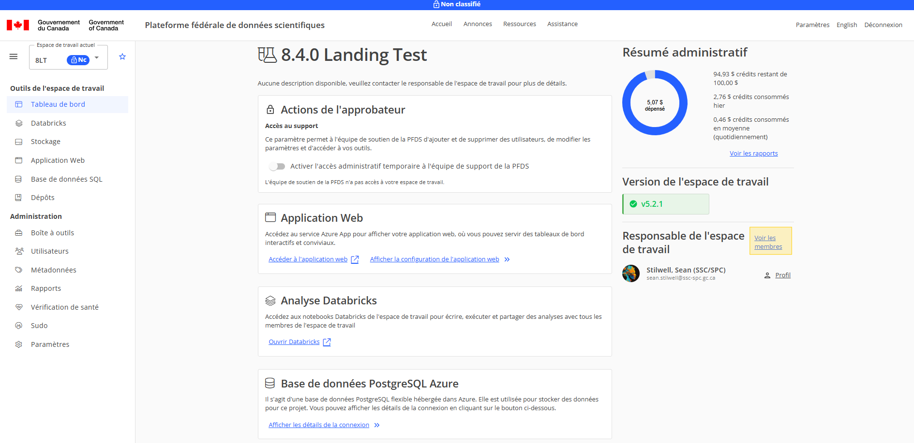
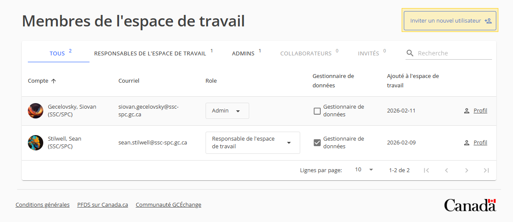
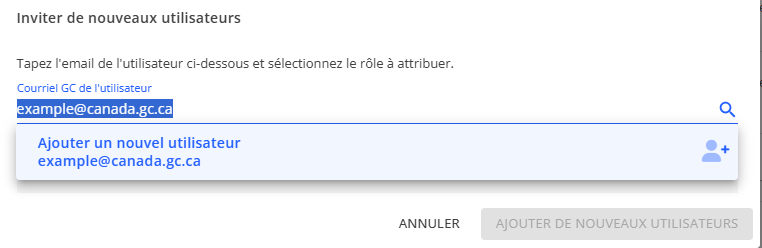
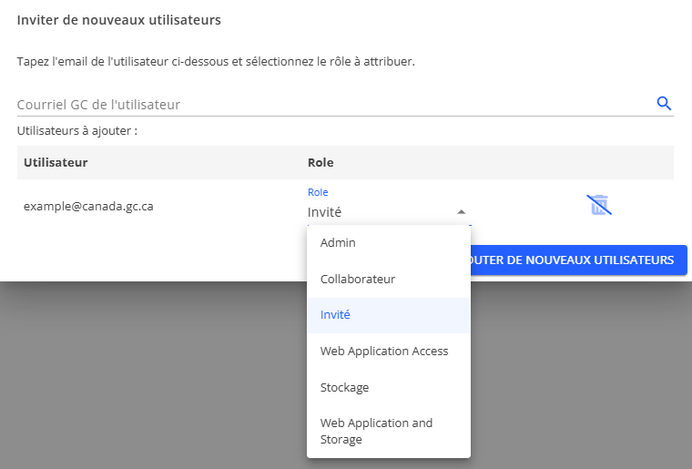
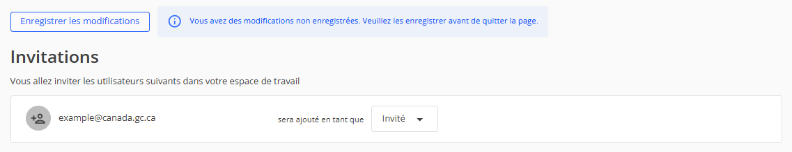
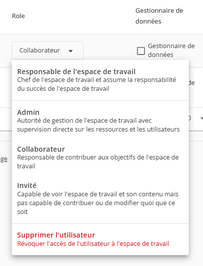
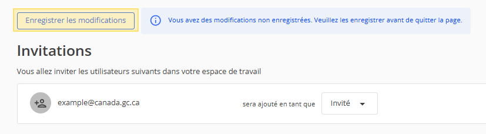

# Invitez un utilisateur
 
 Ce guide explique comment inviter un utilisateur à rejoindre votre espace de travail.

> Note:* Seuls les utilisateurs ayant le rôle `Admin` ou `Lead` peuvent inviter de nouveaux utilisateurs à rejoindre leur espace de travail.

1. Accédez à votre espace de travail
1. Cliquez sur le lien "Voir les membres" dans le coin supérieur droit de la page.
    
1. Cliquez sur le bouton "Inviter un nouvel utilisateur".
    
1. Entrez le courriel du gouvernement du Canada de l'utilisateur que vous souhaitez inviter et cliquez sur la liste déroulante.
    
    
    > *Remarque:* Si l'utilisateur a déjà un compte FSDH, il apparaîtra dans la liste déroulante et vous pourrez le sélectionner.

1. Choisissez le rôle pour l'utilisateur. Cliquez sur le bouton "Ajouter de nouveaux utilisateurs" une fois que vous avez entré tous les utilisateurs que vous souhaitez inviter.
    

    > *Remarque:* Si vous souhaitez inviter plus d'utilisateurs, vous pouvez toujours cliquer sur le bouton "Inviter un nouvel utilisateur" à nouveau et répéter le processus.

1. Si vous voulez changer le rôle d'un utilisateur que vous venez d'inviter, cliquez sur la liste déroulante du rôle de l'utilisateur que vous allez inviter.
    

1. Sélectionnez le nouveau rôle dans la liste déroulante
    

1. Cliquez sur "Enregistrer les modifications" en haut de la page.
    